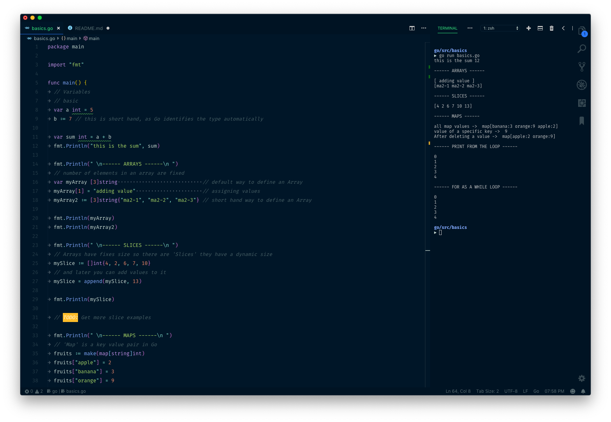

# GO lang codded documentation - list of codes to understand Go

## Installation

Follow the instructions on [Go's official documentation](https://golang.org/doc/install).

## Goal of this documentation

As I started learning Go lang I was looking for a documentation with a list features with example codes. So this is an attempt to have a documentation like that.

## Structure and how to follow

Every file contains executable code and the description is in the comments of the code.
You can run the code by navigating to the file's directory in your terminal and running

`go run basic.go`

## Contribution

As I am new to the Go ecosystem, feel free to contribute if you find this repo helpful and help me out as I build this documentation with executable code.